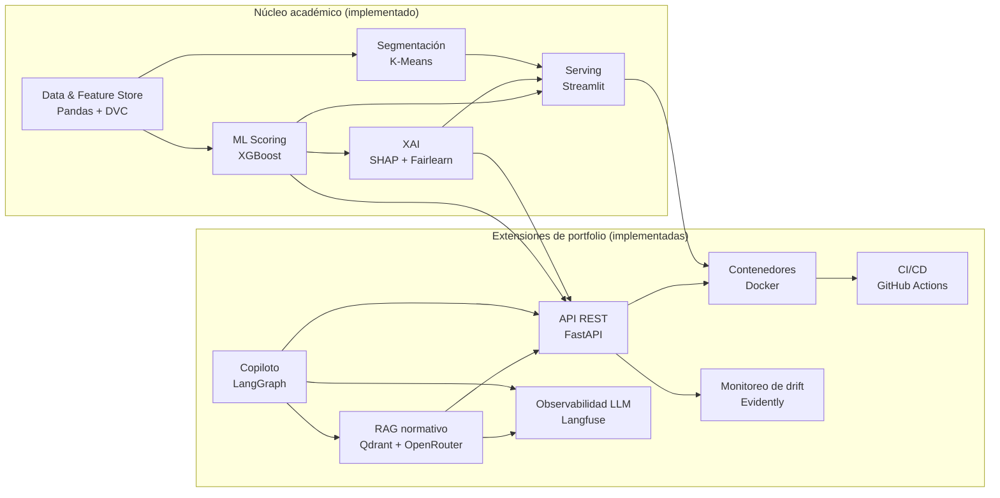

# CrediXAI

Un modelo de scoring crediticio que, además de predecir riesgo de default, audita si esa predicción es equitativa entre grupos, y lo demuestra: encontró que el modelo amplifica al doble la disparidad real de default por género y edad, un hallazgo que un scoring de caja negra nunca hubiera expuesto.

Desarrollado como Práctica Profesionalizante (Tecnicatura Superior en Data Science, Teclab), sobre el dataset Home Credit Default Risk (Kaggle).

## Resultado técnico

- **ROC-AUC 0.7815** en holdout (0.7802 ± 0.0032 en validación cruzada de 5 folds), +1.6 puntos sobre el baseline de Regresión Logística.
- **Explicaciones SHAP estables:** Kendall tau = 0.9917 ± 0.0010 sobre 30 remuestreos bootstrap del ranking de importancia.
- **Auditoría de fairness cuantificada:** el modelo amplifica la brecha real de default por género y edad en aproximadamente 2x (detalle en `docs/model-card.md` y `docs/informe-final.md` sección 5.4).
- **Reason codes de adverse action** que excluyen atributos protegidos de la comunicación al solicitante, aun cuando el modelo los usa internamente.

## Arquitectura



Diagrama de componentes completo (incluidas las extensiones planificadas) y decisiones de arquitectura (ADRs) en `docs/`.
El estilo elegido es service-based, justificado en `docs/architecture-style-selection.md`.

## Documentación

| Documento | Contenido |
|---|---|
| `docs/guia-de-usuario.md` | Cómo usar la app paso a paso: dashboard, preguntas al RAG normativo y memo del copiloto (sin escribir código) |
| `docs/informe-final.md` | Metodología y resultados completos, tarea por tarea (EDA, features, clustering, modelado, XAI/fairness, dashboard) |
| `docs/informe-ejecutivo.md` | Resumen para público no técnico |
| `docs/model-card.md` | Performance, fairness, limitaciones y uso previsto del modelo |
| `docs/adr/` | Decisiones de arquitectura (ADRs) |
| `docs/architecture-characteristics.md`, `docs/architecture-style-selection.md` | Trade-offs de diseño |

## Estructura del repo

```
data/           # datos crudos y procesados (versionados con DVC, no con git)
notebooks/      # notebooks por tarea (EDA, features, clustering, XAI...)
scripts/        # entrypoints reproducibles por tarea (ej. 02_features.py)
src/credixai/   # paquete Python reutilizable
app/            # dashboard Streamlit (entrypoint delgado sobre src/credixai)
models/         # artefactos de modelos entrenados
docs/           # informes, model card, architecture characteristics, ADRs, diagramas
tests/          # tests automatizados
```

## Setup

Camino rápido, de punta a punta (dependencias, dataset de Kaggle, pipeline completo hasta el modelo entrenado, e ingesta del RAG normativo):

```
make setup
```

Requiere antes: credenciales de la API de Kaggle (ver `scripts/00_download_data.py`) y un `.env` con `OPENROUTER_API_KEY` (ver `.env.example`).

Para levantar todo el stack containerizado (API, dashboard, Qdrant y Langfuse self-hosteado):

```
make up    # levanta todo
make down  # lo baja
```

Si preferís correr los pasos a mano en vez de `make setup` (por ejemplo para debuggear un paso puntual), o solo instalar dependencias sin tocar datos:

```
uv sync
```

## Tests

Tests unitarios sobre `src/credixai` (features, clustering, modeling, explainability), con datos sintéticos generados en el propio test: no requieren el dataset de Kaggle.

```
uv run ruff check .
uv run pytest
uv run pytest --cov=credixai --cov=app --cov-report=term-missing   # con cobertura
```

Ambos pasos corren en CI en cada push/PR a `main` (`.github/workflows/ci.yml`), junto con el build de las dos imágenes Docker.

`src/credixai` (la lógica reutilizable) está al 100% de cobertura, salvo `dashboard.py` al 98% (la única línea sin cubrir lee el parquet real, un límite de I/O verificado manualmente).
`app/dashboard.py` y la inicialización de la API (`get_service()`) no están cubiertos por la suite rápida a propósito: requieren el dataset real y un runtime completo (Streamlit/Uvicorn); se verifican manualmente contra datos reales, documentado en `docs/informe-final.md`.

Los tests bajo `tests/rag/` que llaman a OpenRouter real están marcados `integration` y excluidos por default (`addopts = "-m 'not integration'"` en `pyproject.toml`); se corren manualmente con `uv run pytest -m integration` cuando hay `OPENROUTER_API_KEY` disponible.

## Cómo correr

Con los datos ya versionados (ver sección "Datos" abajo), reproducir el pipeline completo en orden:

```
uv run python scripts/02_features.py
uv run python scripts/03_clustering.py
uv run python scripts/04_modeling.py
uv run python scripts/05_explainability.py
```

Para explorar los resultados de forma interactiva (dashboard con métricas, segmentación, fairness y explicación por solicitud):

```
uv run python app/dashboard_launcher.py
```

Para levantar la API REST (`/score`, `/explain`, docs interactivas en `/docs`):

```
uv run uvicorn app.api:app --reload
```

## Docker

API y dashboard corren en contenedores separados (un proceso por imagen, alineado con el estilo service-based del proyecto).
`data/processed` no se hornea en la imagen porque se versiona con DVC, no con git: se monta como volumen de solo lectura en runtime.

```
docker compose up --build
```

Deja la API en `http://localhost:8000` (`/health`, `/score/{id}`, `/explain/{id}`, docs en `/docs`) y el dashboard en `http://localhost:8501`.

El contrato de las imágenes (build exitoso, healthcheck en verde con datos reales montados) se valida con:

```
bash tests/smoke/docker_smoke.sh
```

## RAG normativo

`POST /rag/query` responde preguntas de política/normativa (BCRA, Basilea, adverse action, política interna) citando siempre documento y fragmento fuente.
El corpus (`docs/policy_corpus/`) son resúmenes sintetizados con fines educativos, no el texto normativo oficial.
Retrieval híbrido (Qdrant + BM25, fusionados con Reciprocal Rank Fusion) y reranking listwise, ambos con un único provider LLM (OpenRouter).
También disponible desde la pestaña "Consulta normativa" del dashboard (`docs/guia-de-usuario.md`), sin necesidad de usar la API directo.

Requiere `OPENROUTER_API_KEY` (copiar `.env.example` a `.env`) y Qdrant corriendo:

```
docker compose up -d qdrant
uv run python scripts/06_rag_ingest.py     # ingesta el corpus (una vez, o tras cambiar docs/policy_corpus/)
uv run uvicorn app.api:app --reload
```

Evaluación con RAGAS (faithfulness, answer relevancy), resultado y limitaciones documentadas en `docs/informe-final.md` sección 8.5:

```
uv run python scripts/07_rag_eval.py
```

## Copiloto agentico

`POST /copilot/memo/{sk_id_curr}` investiga una solicitud y redacta un borrador de memo crediticio con reason codes y citas de politica.
Orquestador LangGraph con tool-calling real (patron orchestrator-workers): decide dinamicamente que tools llamar segun el caso (`score_application`, y si es alto riesgo tambien `explain_shap` y `retrieve_policy`), todas via HTTP contra esta misma API en vez de imports directos.
Un loop evaluator-optimizer (precheck deterministico + juez LLM) revisa el memo antes de entregarlo: si no pasa, se redacta una vez mas con el feedback; si vuelve a fallar, la respuesta queda en `status: needs_human_review` en vez de reintentar indefinidamente.
Tambien disponible desde la pestania "Copiloto" del dashboard (`docs/guia-de-usuario.md`), sin necesidad de usar la API directo.

Mismos requisitos que RAG normativo (Qdrant + `OPENROUTER_API_KEY`), mas el modelo ya entrenado:

```
docker compose up -d qdrant
uv run python scripts/06_rag_ingest.py
uv run uvicorn app.api:app --reload
curl -X POST http://localhost:8000/copilot/memo/100002
```

## Observabilidad (Langfuse)

Todas las llamadas a LLM del proyecto (RAG y copiloto) pasan por `OpenRouterClient`, que es el unico punto donde se instrumentan como generations de Langfuse.
`/rag/query` y `/copilot/memo/{sk_id_curr}` abren ademas un span raiz por request, asi que las generations anidadas quedan agrupadas en una sola traza sin pasar un objeto trace a mano por el pipeline o el grafo.
Cada corrida del copiloto queda scoreada con `evaluator_passed_first_try` (si aprobo sin necesitar el reintento del evaluator-optimizer), que operacionaliza la metrica de agente del proyecto.

Self-hosteado via docker-compose (Postgres + ClickHouse + Redis + MinIO + Langfuse), usando el stack oficial que publica el propio proyecto Langfuse:

```
docker compose up -d postgres clickhouse redis minio langfuse-worker langfuse-web
```

La UI queda en `http://localhost:3000`; el primer signup genera `LANGFUSE_PUBLIC_KEY`/`LANGFUSE_SECRET_KEY`, que van al `.env` junto a `LANGFUSE_HOST=http://localhost:3000`.
Sin esas claves, el SDK de Langfuse queda deshabilitado (no-op) y el resto del proyecto sigue funcionando igual, sin trazas.

Validacion del juez LLM del evaluator-optimizer contra un golden set etiquetado a mano (TPR/TNR, segun el umbral de validacion del juez LLM >= 0.90), resultado y limitaciones documentados en `docs/informe-final.md` seccion 8.7:

```
uv run python scripts/08_langfuse_judge_validation.py
```

## Monitoreo de drift (Evidently)

`GET /score/{sk_id_curr}` loguea cada predicción real (timestamp, `sk_id_curr`, probabilidad, decisión) en `models/monitoring/prediction_log.jsonl`, un log append-only.

Como el dataset es estático (Home Credit Default Risk, Kaggle) y no hay tráfico productivo real, la población "actual" para medir drift es `application_test` (`IS_TRAIN==0` en `features.parquet`): solicitudes reales que Kaggle reserva sin `TARGET` para su competencia, nunca usadas para entrenar el modelo.
La referencia es `application_train` (`IS_TRAIN==1`), la población sobre la que se entrenó.

```
uv run python scripts/09_drift_report.py
```

Batch-scorea las ~48.700 solicitudes de `application_test` (logueando cada predicción con el mismo mecanismo que `/score`), corre Evidently (`DataDriftPreset`, PSI por columna, umbral de alerta > 0.2 según RNF-4) y guarda el reporte en `models/monitoring/drift_report.html`.
Resultado real (sin perturbación sintética), documentado en `docs/informe-final.md` sección 8.8: 6 de 301 columnas superan el umbral, la más notable `bb_no_record` (PSI≈1.55), consistente con una diferencia real de cobertura de `bureau_balance` entre las dos poblaciones ya señalada en la Tarea 2.

## Datos

Los datos (`data/raw`, `data/processed`) se versionan con DVC, no con git; el repo solo trackea `data/raw.dvc` y `data/processed.dvc` (metadatos con hash).
`make setup` descarga `data/raw` desde Kaggle (`scripts/00_download_data.py`, idempotente) y genera `data/processed` corriendo el pipeline (Tareas 2 y 3), versionando ambos con DVC en el proceso.
Por ahora el cache de DVC es local (sin remote configurado): quien ya tenga acceso al mismo cache local puede usar `dvc checkout` en vez de descargar de nuevo.

```
dvc status   # ver si data/raw o data/processed cambiaron respecto al .dvc trackeado
dvc add data/raw data/processed   # re-trackear después de un cambio manual
```
