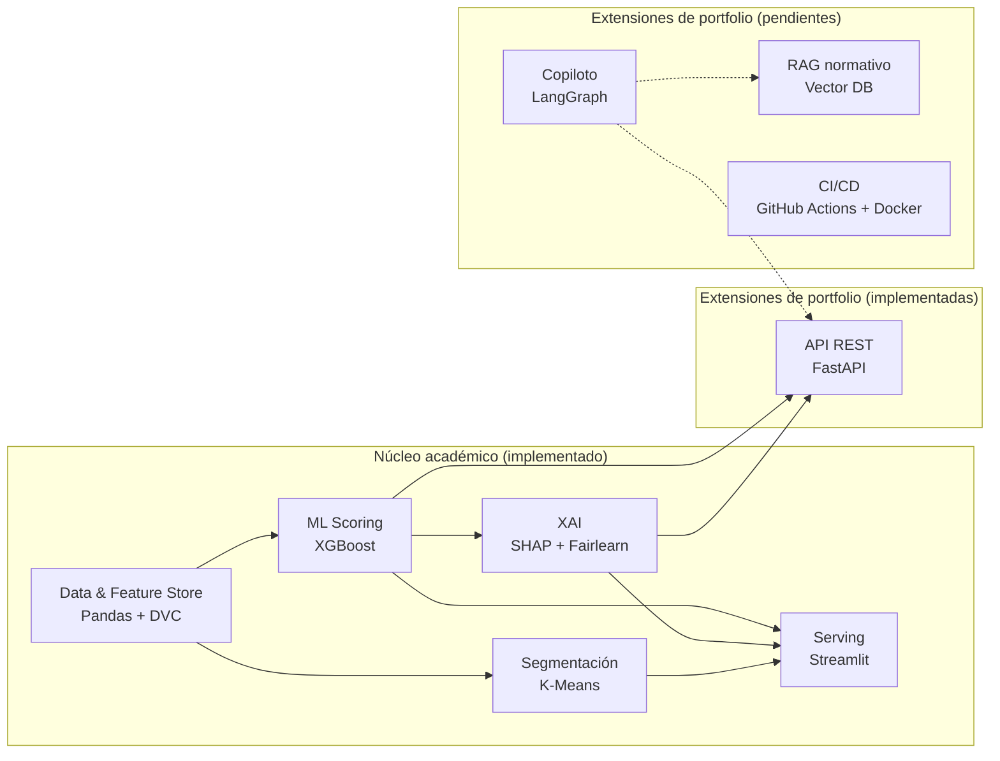

# CrediXAI

Un modelo de scoring crediticio que, además de predecir riesgo de default, audita si esa predicción es equitativa entre grupos, y lo demuestra: encontró que el modelo amplifica al doble la disparidad real de default por género y edad, un hallazgo que un scoring de caja negra nunca hubiera expuesto.

Desarrollado como Práctica Profesionalizante (Tecnicatura Superior en Data Science, Teclab), sobre el dataset Home Credit Default Risk (Kaggle).

## Resultado técnico

- **ROC-AUC 0.7815** en holdout (0.7802 ± 0.0032 en validación cruzada de 5 folds), +1.6 puntos sobre el baseline de Regresión Logística.
- **Explicaciones SHAP estables:** Kendall tau = 0.9917 ± 0.0010 sobre 30 remuestreos bootstrap del ranking de importancia.
- **Auditoría de fairness cuantificada:** el modelo amplifica la brecha real de default por género y edad en aproximadamente 2x (detalle en `docs/model-card.md` y `docs/informe-final.md` sección 5.4).
- **Reason codes de adverse action** que excluyen atributos protegidos de la comunicación al solicitante, aun cuando el modelo los usa internamente.

## Arquitectura



Diagrama de componentes completo (incluidas las extensiones planificadas) y decisiones de arquitectura (ADRs) en `docs/`.
El estilo elegido es service-based, justificado en `docs/architecture-style-selection.md`.

## Documentación

| Documento | Contenido |
|---|---|
| `docs/informe-final.md` | Metodología y resultados completos, tarea por tarea (EDA, features, clustering, modelado, XAI/fairness, dashboard) |
| `docs/informe-ejecutivo.md` | Resumen para público no técnico |
| `docs/model-card.md` | Performance, fairness, limitaciones y uso previsto del modelo |
| `docs/adr/` | Decisiones de arquitectura (ADRs) |
| `docs/architecture-characteristics.md`, `docs/architecture-style-selection.md` | Trade-offs de diseño |
| `prd.md` | Producto y alcance completo del proyecto |

## Estructura del repo

```
data/           # datos crudos y procesados (versionados con DVC, no con git)
notebooks/      # notebooks por tarea (EDA, features, clustering, XAI...)
scripts/        # entrypoints reproducibles por tarea (ej. 02_features.py)
src/credixai/   # paquete Python reutilizable
app/            # dashboard Streamlit (entrypoint delgado sobre src/credixai)
models/         # artefactos de modelos entrenados
docs/           # informes, model card, architecture characteristics, ADRs, diagramas
tests/          # tests automatizados
```

## Setup

```
uv sync
```

## Tests

Tests unitarios sobre `src/credixai` (features, clustering, modeling, explainability), con datos sintéticos generados en el propio test: no requieren el dataset de Kaggle.

```
uv run pytest
```

## Cómo correr

Con los datos ya versionados (ver sección "Datos" abajo), reproducir el pipeline completo en orden:

```
uv run python scripts/02_features.py
uv run python scripts/03_clustering.py
uv run python scripts/04_modeling.py
uv run python scripts/05_explainability.py
```

Para explorar los resultados de forma interactiva (dashboard con métricas, segmentación, fairness y explicación por solicitud):

```
uv run streamlit run app/dashboard.py
```

Para levantar la API REST (`/score`, `/explain`, docs interactivas en `/docs`):

```
uv run uvicorn app.api:app --reload
```

## Datos

Los datos (`data/raw`, `data/processed`) se versionan con DVC, no con git; el repo solo trackea `data/raw.dvc` y `data/processed.dvc` (metadatos con hash).
Por ahora el cache de DVC es local (sin remote configurado): quien clone el repo necesita colocar el dataset original de Kaggle en `data/raw/` y correr `dvc add data/raw data/processed` para que los hashes coincidan, o `dvc checkout` si ya tiene acceso al mismo cache local.

```
dvc status   # ver si data/raw o data/processed cambiaron respecto al .dvc trackeado
dvc add data/raw data/processed   # re-trackear después de un cambio
```
