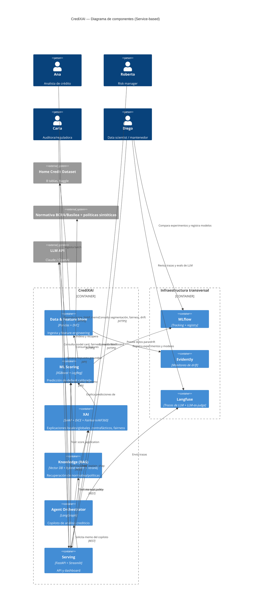

# Component Diagram — CrediXAI

**Fuente:** `docs/adr/ADR-001-service-based-architecture.md`, PRD §4 (personas), §7.1 (diagrama original de capas).

```mermaid
C4Container
    title CrediXAI — Diagrama de componentes (Service-based)

    Person(ana, "Ana", "Analista de crédito")
    Person(roberto, "Roberto", "Risk manager")
    Person(carla, "Carla", "Auditora/reguladora")
    Person(diego, "Diego", "Data scientist / mantenedor")

    System_Ext(homecredit, "Home Credit Dataset", "8 tablas, Kaggle")
    System_Ext(corpus, "Normativa BCRA/Basilea + políticas sintéticas")
    System_Ext(llm, "LLM API", "Claude / OpenAI")

    Container_Boundary(credixai, "CrediXAI") {
        Container(data, "Data & Feature Store", "Pandas + DVC", "Ingesta y feature engineering")
        Container(ml, "ML Scoring", "XGBoost + LogReg", "Predicción de default calibrada")
        Container(xai, "XAI", "SHAP + DiCE + Fairlearn/AIF360", "Explicaciones locales/globales, contrafácticos, fairness")
        Container(rag, "Knowledge (RAG)", "Vector DB + hybrid search + rerank", "Recuperación de normativa/políticas")
        Container(agent, "Agent Orchestrator", "LangGraph", "Copiloto de análisis crediticio")
        Container(serving, "Serving", "FastAPI + Streamlit", "API y dashboard")
    }

    Container_Boundary(infra, "Infraestructura transversal") {
        Container(mlflow, "MLflow", "Tracking + registry")
        Container(evidently, "Evidently", "Monitoreo de drift")
        Container(langfuse, "Langfuse", "Trazas de LLM + LLM-as-judge")
    }

    Rel(ana, serving, "Consulta score, SHAP, memo", "HTTPS")
    Rel(roberto, serving, "Consulta segmentación, fairness, drift", "HTTPS")
    Rel(carla, serving, "Consulta model card, fairness, trazabilidad", "HTTPS")
    Rel(diego, serving, "Consulta dashboard", "HTTPS")
    Rel(diego, mlflow, "Compara experimentos y registra modelos")
    Rel(diego, langfuse, "Revisa trazas y evals de LLM")

    Rel(serving, ml, "Solicita score", "REST")
    Rel(serving, xai, "Solicita explicación", "REST")
    Rel(serving, agent, "Solicita memo del copiloto", "REST")

    Rel(agent, ml, "Tool: score_application")
    Rel(agent, xai, "Tool: explain_shap")
    Rel(agent, rag, "Tool: retrieve_policy")
    Rel(agent, llm, "Genera borrador de memo", "API")

    Rel(ml, data, "Consume features")
    Rel(xai, ml, "Explica predicciones de")
    Rel(data, homecredit, "Ingesta batch")
    Rel(rag, corpus, "Indexa y recupera")
    Rel(rag, llm, "Genera respuesta grounded", "API")

    Rel(ml, mlflow, "Registra experimentos y modelos")
    Rel(agent, langfuse, "Envía trazas")
    Rel(data, evidently, "Provee datos para drift")
```
