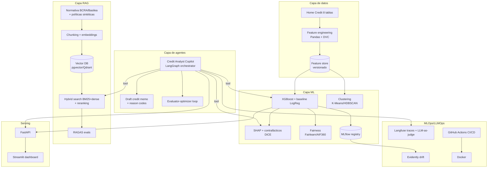

# PRD — Sistema de Scoring Crediticio con Explicabilidad Algorítmica y Copiloto Agéntico (CrediXAI)

**Autor:** Lorenzo Tomás Diez · **Institución:** Teclab (Instituto Técnico Superior, Argentina) · **Materia:** Práctica Profesionalizante — Tecnicatura Superior en Data Science · **Período académico:** 1A 2026 (24 marzo – 26 julio 2026) · **Versión:** 1.0 · **Fecha:** 8 de julio de 2026

---

## TL;DR
- **Qué:** Un sistema end-to-end de scoring crediticio para una fintech argentina simulada que predice incumplimiento de pagos con XGBoost sobre el dataset Home Credit Default Risk, explica cada decisión con SHAP + contrafácticos, y añade una capa RAG sobre normativa BCRA/Basilea y un copiloto agéntico (LangGraph) que redacta memos crediticios; todo cubierto por MLOps/LLMOps de nivel producción.
- **Por qué doble propósito:** Un único documento que satisface las 7 tareas aprobadas del plan de trabajo de Teclab Y demuestra habilidades de ingeniería de IA de nivel staff/principal (L8) para portfolio, combinando ML clásico, RAG, agentes y tooling moderno.
- **Meta cuantitativa:** AUC ≥ 0.79 (referencia: el 1.º puesto Kaggle logró **0.80570** AUC privado; un LightGBM single fuerte ≈ **0.804**), RAGAS faithfulness ≥ 0.90, y un costo de APIs estimado en el rango de **decenas de dólares** para todo el proyecto.

---

## 1. Resumen ejecutivo

CrediXAI es un sistema de decisión crediticia responsable, explicable y auditable, construido sobre datos públicos reales (Home Credit Default Risk, Kaggle) y orientado al contexto de una fintech argentina simulada de préstamos al consumo. El proyecto resuelve un problema con relevancia regulatoria concreta: en la UE, el AI Act clasifica el credit scoring de personas físicas como sistema de **alto riesgo** — el Annex III, Sección 5(b) nombra directamente los sistemas de evaluación de solvencia y credit scoring, y el Art. 6(3) impide reclasificarlos como no-alto-riesgo cuando perfilan personas; en EE.UU., ECOA/Regulation B obliga a entregar razones específicas de rechazo (adverse action notices); y en Argentina, el BCRA define y regula el uso de modelos de "credit scoring". La explicabilidad no es un adorno: es un requisito legal y de gobernanza.

El documento tiene un **doble propósito deliberado**: (1) cumplir en su totalidad el plan de trabajo aprobado por Teclab —mapeando explícitamente las 7 tareas académicas a componentes del sistema— y (2) servir como proyecto insignia de portfolio que evidencie dominio de ingeniería de IA moderna. Para ello, la arquitectura base (EDA → feature engineering → clustering → modelado supervisado → XAI → visualización → documentación) se extiende con tres capas avanzadas bien motivadas:

- **Capa RAG**: recuperación sobre normativa BCRA, marco Basilea y políticas de crédito sintéticas, para generar explicaciones en lenguaje natural fundamentadas ("grounded") en documentos de política, evitando alucinaciones.
- **Capa de agentes**: un copiloto de analista de crédito (orquestador-workers en LangGraph) que investiga una solicitud, consulta el modelo ML vía tool, recupera explicaciones SHAP, busca política vía RAG y redacta un borrador de memo crediticio con razones de acción adversa.
- **Capa MLOps/LLMOps**: experiment tracking (MLflow), monitoreo de drift (Evidently), observabilidad de LLM (Langfuse), serving (FastAPI), dashboard (Streamlit), CI/CD (GitHub Actions) y contenedores (Docker).

El resultado es un artefacto único que "habla los dos idiomas": el del evaluador académico y el del hiring manager senior.

## 2. Contexto y problema

### 2.1 Contexto de negocio (fintech argentina)
Las fintech de crédito al consumo en Argentina operan con alta incertidumbre macroeconómica y una porción significativa de solicitantes con historial crediticio escaso o nulo ("thin file"/unbanked). Home Credit —el proveedor que originó el dataset— se especializa justamente en préstamo responsable a población con poco o ningún historial. El problema central: **decidir a quién prestar y a qué condiciones, minimizando la incobrabilidad sin excluir injustamente a buenos pagadores**, y haciéndolo de forma explicable ante clientes, oficiales de riesgo y reguladores.

### 2.2 El problema técnico
Predicción de default (clasificación binaria desbalanceada). El dataset Home Credit tiene una tasa de default del **8.07% (24.825 de 307.511 solicitantes)** —confirmada por Japinye & Adedugbe (2025): *"Home Credit Default Risk (N=307,511, default rate 8.07%)"*—, lo que exige métricas robustas al desbalanceo (ROC-AUC como métrica primaria, complementada con PR-AUC, KS y calibración/Brier). El desafío modelístico incluye integrar 8 tablas relacionales, ingeniería de features agregadas y balancear performance vs. explicabilidad.

### 2.3 Por qué importa la explicabilidad (contexto regulatorio)
- **UE — AI Act (Reg. (UE) 2024/1689):** el scoring crediticio de personas físicas es alto riesgo (Annex III 5(b)), con obligaciones de gestión de riesgo (Art. 9), gobernanza de datos y examen de sesgos (Art. 10), documentación técnica (Art. 11 / Annex IV), logging (Art. 12), transparencia (Art. 13), supervisión humana con capacidad de override (Art. 14) y robustez/ciberseguridad (Art. 15). Las obligaciones de alto riesgo tenían fecha originaria del **2 de agosto de 2026**; el acuerdo provisional del "Digital Omnibus" (6–7 de mayo de 2026) difiere las obligaciones de alto riesgo de sistemas Annex III (incluido credit scoring) *"from 2 August 2026 to 2 December 2027"*, pero **el 2 de agosto de 2026 sigue siendo una fecha de cumplimiento activa** hasta la adopción formal (Gibson Dunn, 2026, "EU AI Act Omnibus Agreement"). El proyecto usa este marco como referencia de best-practice, no porque opere en la UE.
- **EE.UU. — ECOA / Regulation B:** obliga a entregar "specific reasons" de rechazo (adverse action notice). El Comentario oficial del CFPB a 12 CFR §1002.9 aclara: *"A creditor must disclose the principal reasons for denying an application or taking other adverse action. The regulation does not mandate that a specific number of reasons be disclosed, but disclosure of more than four reasons is not likely to be helpful to the applicant."* Esto motiva directamente los reason codes basados en SHAP y las explicaciones contrafácticas.
- **Argentina — BCRA:** define los modelos de "credit scoring" como métodos matemáticos/estadístico-econométricos para medir el riesgo y/o probabilidad de incumplimiento, exigiendo variables relevantes y aplicación sistemática y periódicamente actualizada. Publicaciones del BCRA (p. ej. "Modelos de Credit Scoring - Qué, Cómo, Cuándo y Para Qué") y comunicaciones ("A" 5995/2016, "A" 7406) enmarcan el uso.
- **Referencia de gobernanza de modelos:** el marco SR 11-7 (Fed/OCC de EE.UU.) sobre model risk management inspira el ciclo de validación, monitoreo y documentación.

### 2.4 Estado del arte técnico (síntesis de literatura)
El estudio de referencia de Japinye, A. O. & Adedugbe, A. A. (2025), *"Explainable AI for Credit Scoring with SHAP-Calibrated Ensembles: A Multi-Market Evaluation on Public Lending Data"* (SSR Publisher) —evaluado sobre Home Credit, Default of Credit Card Clients y LendingClub— reporta: *"XGBoost with SHAP achieves an AUC of 0.892±0.009 to 0.923±0.008 across datasets while maintaining explanation stability (Kendall τ=0.94±0.03) and good calibration (Brier score 0.119±0.003 to 0.154±0.004). Fairness-constrained thresholding reduces demographic-parity gaps by 59-67% (95% CI: 52-74%) with cost increases of 3.2±0.8% to 5.8±1.3%."* La evidencia también sugiere que el "trade-off" performance-explicabilidad suele ser sobreestimado.

## 3. Objetivos y no-objetivos

### 3.1 Objetivos académicos (compliance Teclab)
1. Ejecutar y documentar las 7 tareas aprobadas (ver matriz §5).
2. Usar exclusivamente el stack aprobado como núcleo (Python, Pandas, Scikit-learn, XGBoost, SHAP, Matplotlib, Seaborn, Plotly, Streamlit, Jupyter, GitHub).
3. Entregar los 4 módulos + video-presentación según requisitos de la Práctica Profesionalizante.

### 3.2 Objetivos profesionales (portfolio L8)
4. Construir un sistema end-to-end reproducible, containerizado y con CI/CD.
5. Integrar RAG grounded + copiloto agéntico con evaluación cuantitativa (RAGAS, LLM-as-judge).
6. Implementar auditoría de fairness, model card y monitoreo de drift.
7. Publicar repo GitHub, demo en vivo, model card y un writeup técnico (blog).

### 3.3 No-objetivos
- **No** se desplegará en producción real ni se procesarán datos de personas reales (dataset público, fintech simulada).
- **No** se usará un LLM como scorer crediticio end-to-end (los LLMs se usan como generadores de explicaciones y orquestadores, no como el modelo de decisión; el estado del arte considera el scoring LLM end-to-end inadecuado para alto riesgo).
- **No** se busca ganar la competencia Kaggle ni superar el AUC del 1.º puesto; el objetivo es un AUC competitivo (≥0.79) con foco en explicabilidad, fairness y arquitectura.
- **No** se implementará fine-tuning de LLMs (se prioriza RAG por freshness, control y costo).

## 4. Personas y user stories

**Persona A — Ana, Analista de Crédito.** Necesita decidir solicitudes rápido y justificar cada una.
- *US-A1:* Como analista, quiero ver la probabilidad de default y los 5 factores SHAP principales de una solicitud, para decidir con fundamento.
- *US-A2:* Como analista, quiero que el copiloto redacte un borrador de memo crediticio con razones de acción adversa, para ahorrar tiempo.

**Persona B — Roberto, Risk Manager.** Responsable de la cartera y de la política de riesgo.
- *US-B1:* Como risk manager, quiero ver la segmentación de clientes por perfil de riesgo, para ajustar políticas por segmento.
- *US-B2:* Como risk manager, quiero alertas de data drift, para saber cuándo re-entrenar.

**Persona C — Carla, Auditora/Reguladora.** Verifica cumplimiento y equidad.
- *US-C1:* Como auditora, quiero la model card y las métricas de fairness por grupo protegido, para evaluar sesgos.
- *US-C2:* Como auditora, quiero que cada explicación en lenguaje natural cite la política/normativa en que se funda, para verificar trazabilidad.

**Persona D — Diego, Data Scientist (mantenedor).** Itera modelos y prompts.
- *US-D1:* Como DS, quiero experiment tracking y model registry, para comparar y reproducir experimentos.
- *US-D2:* Como DS, quiero traces de las llamadas al LLM y scores de evaluación, para depurar el RAG y los agentes.

## 5. Mapeo de las 7 tareas académicas aprobadas (matriz de compliance)

| # | Tarea aprobada (plan Teclab) | Componente del sistema | Tecnologías (stack aprobado + extensiones) | Entregable/Evidencia |
|---|---|---|---|---|
| 1 | Relevamiento y análisis exploratorio (EDA) | Notebook de EDA sobre las 8 tablas Home Credit | Pandas, Matplotlib, Seaborn, Plotly, Jupyter | `01_eda.ipynb` + informe de hallazgos |
| 2 | Preprocesamiento y feature engineering | Pipeline de limpieza + agregaciones relacionales | Pandas, Scikit-learn (Pipeline/ColumnTransformer) | `02_features.py` + feature store versionado (DVC) |
| 3 | Segmentación no supervisada de perfiles | Clustering de clientes (K-Means/HDBSCAN) + perfiles | Scikit-learn, Plotly | `03_clustering.ipynb` + tabla de segmentos |
| 4 | Modelado predictivo supervisado | Modelo de default (XGBoost, baseline LogReg) | XGBoost, Scikit-learn, MLflow *(ext.)* | Modelo registrado + métricas AUC/KS |
| 5 | Explicabilidad algorítmica | SHAP (global/local) + contrafácticos + reason codes | SHAP, DiCE *(ext.)*, Fairlearn/AIF360 *(ext.)* | `05_xai.ipynb` + reason codes |
| 6 | Visualización e informe ejecutivo | Dashboard interactivo + informe ejecutivo | Streamlit, Plotly | App Streamlit desplegada + informe PDF |
| 7 | Documentación técnica | README, model card, arquitectura, API docs | GitHub, Markdown, FastAPI (OpenAPI) *(ext.)* | Repo documentado + model card |

*Las extensiones marcadas (ext.) son adiciones de portfolio que envuelven y potencian el núcleo aprobado sin reemplazarlo.*

## 6. Requerimientos funcionales y no funcionales

### 6.1 Funcionales (RF)
- **RF-1:** El sistema predice P(default) para una solicitud dada, devolviendo probabilidad calibrada y decisión (aprobado/rechazado/revisión) según umbral configurable.
- **RF-2:** Genera explicación local SHAP (top-N features con contribución) por solicitud.
- **RF-3:** Genera al menos una explicación contrafáctica accionable ("si X bajara a Y, la decisión cambiaría").
- **RF-4:** Produce reason codes compatibles con adverse action (≤4 razones principales, alineado con el Comentario CFPB a §1002.9).
- **RF-5:** El RAG responde preguntas de política/normativa citando la fuente (documento + fragmento).
- **RF-6:** El copiloto agéntico investiga una solicitud (llama al modelo, obtiene SHAP, consulta RAG) y redacta un borrador de memo crediticio.
- **RF-7:** El dashboard muestra segmentación, métricas globales, fairness y una vista por solicitud.
- **RF-8:** El sistema expone una API REST (FastAPI) para scoring y explicación.

### 6.2 No funcionales (RNF)
- **RNF-1 (Explicabilidad):** toda decisión debe ser explicable localmente (SHAP) y trazable a política (RAG).
- **RNF-2 (Fairness):** medir statistical parity difference, equal opportunity difference y disparate impact; documentar en model card (rango de referencia [-0.1, 0.1], según convención AIF360).
- **RNF-3 (Reproducibilidad):** todo experimento reproducible vía código versionado, seeds fijos, datos versionados (DVC) y entorno containerizado.
- **RNF-4 (Observabilidad):** trazas de LLM (Langfuse) y logs de predicción; monitoreo de drift (Evidently, PSI>0.2 = alerta).
- **RNF-5 (Latencia):** scoring + SHAP < 2 s por solicitud en la API (portfolio-scale, no producción).
- **RNF-6 (Costo):** el gasto de APIs de LLM debe mantenerse en el rango de decenas de dólares mediante caching y batch.
- **RNF-7 (Seguridad de LLM):** guardrails contra prompt injection y validación de outputs (Pydantic).
- **RNF-8 (Groundedness):** RAGAS faithfulness ≥ 0.90 y answer relevancy ≥ 0.85 en el set de evaluación.

## 7. Arquitectura del sistema

### 7.1 Diagrama (Mermaid)

### 7.2 Capa de datos
Ingesta de las 8 tablas de Home Credit Default Risk (~688 MB total): `application_train.csv` (307.511 filas × 122 columnas), `application_test.csv` (48.744 × 121), `bureau.csv` (1.716.428 × 17), `bureau_balance.csv` (27.299.925 × 3), `POS_CASH_balance.csv` (10.001.358 × 8), `credit_card_balance.csv` (3.840.312 × 23), `previous_application.csv` (1.670.214 × 37) e `installments_payments.csv` (13.605.401 × 8). El feature engineering agrega las tablas relacionales por `SK_ID_CURR` con estadísticas (min/max/mean/sum) y ratios de negocio (credit-to-income, annuity-to-income, credit-to-goods). Las features más predictivas según los competidores Kaggle son las `EXT_SOURCE_1/2/3` (scores externos normalizados): las correlaciones más fuertes con TARGET son EXT_SOURCE_2 (-0.160) y EXT_SOURCE_3 (-0.156). Los datos se versionan con DVC.

### 7.3 Capa ML
- **Modelo primario:** XGBoost (gradient boosting) con manejo de desbalanceo. **Baseline:** Regresión Logística (interpretable por diseño).
- **Segmentación:** clustering no supervisado para perfiles de riesgo (tarea 3).
- **Calibración:** para producir probabilidades confiables (Brier score, target ≤ 0.15).
- **XAI:** SHAP (TreeExplainer) para importancia global y local; contrafácticos con DiCE; reason codes derivados de SHAP para adverse action.
- **Fairness:** Fairlearn/AIF360 sobre atributos proxy (género, edad), midiendo statistical parity, equal opportunity y disparate impact.
- **Tracking:** MLflow (params, métricas, artefactos, model registry).

### 7.4 Capa RAG
- **Corpus:** documentos públicos del BCRA sobre credit scoring y gestión de riesgo, resúmenes del marco Basilea, y un set de **políticas de crédito sintéticas** que yo redacto para la fintech simulada (así puedo generar explicaciones grounded sin exponer datos reales).
- **Pipeline:** chunking semántico → embeddings → vector DB (pgvector si uso Postgres, o Qdrant) → **hybrid search** (BM25 + dense con fusión RRF) → **reranking** con cross-encoder (p. ej. Cohere Rerank o BGE-Reranker) → generación.
- **Patrón:** recuperar top-50 con hybrid search, rerank a top-5, pasar al LLM (mejora reportada de 15–30% en métricas RAGAS; nota: los pipelines RAG naive fallan en retrieval ~40% de las veces, por eso hybrid+rerank es baseline).
- **Evaluación:** RAGAS (faithfulness, answer relevancy, context precision/recall) con targets definidos en §8. Se registran evals en el pipeline de CI. Advertencia metodológica de la literatura: faithfulness alto debe leerse junto a answer relevancy y context recall (un retriever que omite un documento clave puede mantener faithfulness alto respondiendo con contexto parcial).

### 7.5 Capa de agentes
- **Framework:** LangGraph (control de estado explícito, checkpointing, human-in-the-loop; GA en octubre 2025, corre como librería standalone sin dependencia de LangChain), elegido sobre CrewAI por su durabilidad, control granular de transiciones e integración nativa de observabilidad para flujos de aprobación.
- **Patrón:** orchestrator-workers (Anthropic, "Building Effective Agents") — un orquestador descompone la tarea "analizá esta solicitud" y delega en tools/workers: (a) `score_application` (llama XGBoost), (b) `explain_shap`, (c) `retrieve_policy` (RAG), (d) `draft_memo`. Un loop **evaluator-optimizer** revisa el memo antes de entregarlo. Principio rector de Anthropic: empezar con la solución más simple y aumentar complejidad solo cuando aporta valor; los sistemas multi-agente usan ~10-15x más tokens que un agente simple.
- **Tools vía MCP:** exponer el modelo ML, SHAP y el retriever como tools estandarizadas (Model Context Protocol).
- **Guardrails:** validación de outputs con Pydantic, límites de tokens y checkpoint de revisión humana antes de "emitir" el memo (alineado con Art. 14 de supervisión humana del AI Act).

### 7.6 Capa de serving
- **FastAPI:** endpoints `/score`, `/explain`, `/copilot`, con esquemas Pydantic y docs OpenAPI.
- **Streamlit:** dashboard con vistas de segmentación, métricas globales/fairness, y detalle por solicitud (probabilidad + SHAP + memo del copiloto).

### 7.7 Capa MLOps/LLMOps y observabilidad
- **MLflow:** experiment tracking + model registry (data snapshot ID, hiperparámetros, commit SHA para auditabilidad).
- **Evidently:** monitoreo de data/target drift (PSI, KS) con umbral PSI>0.2 como alerta.
- **Langfuse (MIT, self-hosteable):** traces de LLM, prompt management, datasets y LLM-as-judge; validación del juez contra etiquetas humanas (TPR/TNR >90%).
- **CI/CD:** GitHub Actions (lint, tests con pytest, build de Docker, evals de RAG en el pipeline sobre un golden dataset).
- **Docker:** contenedores para API, dashboard y worker de agentes.

## 8. Métricas de éxito

### 8.1 Métricas ML
| Métrica | Target | Referencia/benchmark |
|---|---|---|
| ROC-AUC (test) | ≥ 0.79 | 1.º Kaggle = 0.80570 (privado); single LGBM fuerte ≈ 0.804; H2O AutoML rápido ≈ 0.70 |
| PR-AUC | reportar | dataset desbalanceado (8.07%) |
| KS statistic | reportar | estándar en scoring |
| Brier score / calibración | ≤ 0.15 | Japinye & Adedugbe (2025): 0.119–0.154 |
| Estabilidad SHAP (Kendall τ) | ≥ 0.90 | Japinye & Adedugbe (2025): τ ≈ 0.94 |

*Nota de contexto: el benchmark de estado del arte con XGBoost+SHAP (AUC 0.892–0.923 de Japinye & Adedugbe, 2025) corresponde a evaluaciones multi-dataset que incluyen datasets menos desbalanceados; sobre Home Credit específicamente, el rango competitivo realista con la métrica oficial de la competencia (ROC-AUC) se ubica en 0.79–0.805, por eso el target del proyecto es ≥0.79.*

### 8.2 Métricas RAG (RAGAS)
| Métrica | Target |
|---|---|
| Faithfulness | ≥ 0.90 |
| Answer relevancy | ≥ 0.85 |
| Context precision | ≥ 0.70 |
| Context recall | ≥ 0.75 |

### 8.3 Métricas de agente
- Tool-call accuracy (¿eligió la tool correcta?), agent goal accuracy (¿completó la tarea?), y % de memos que pasan el evaluator-optimizer sin corrección humana.

### 8.4 Métricas de fairness
- Statistical parity difference, equal opportunity difference, disparate impact — dentro de [-0.1, 0.1] como referencia de equidad (convención AIF360).

### 8.5 KPIs de producto (simulados)
- Tiempo de decisión por solicitud, % de solicitudes con explicación completa, reducción de tiempo de redacción de memo.

### 8.6 Métricas de entregable académico
- 7/7 tareas evidenciadas; 4 módulos entregados; video-presentación; repo público.

## 9. Roadmap por fases (calendario 1A 2026)

| Fase | Semanas (aprox.) | Foco | Tareas académicas | Entregables |
|---|---|---|---|---|
| F0 — Setup | 24–31 mar | Repo, entorno, Docker, DVC, descarga dataset | — | Repo inicializado |
| F1 — EDA | abr (sem 1–2) | EDA de las 8 tablas | Tarea 1 | `01_eda.ipynb` |
| F2 — Features + Clustering | abr–may | Feature engineering + segmentación | Tareas 2, 3 | Pipeline + segmentos |
| F3 — Modelado | may | XGBoost + baseline + MLflow | Tarea 4 | Modelo registrado |
| F4 — XAI + Fairness | may–jun | SHAP, contrafácticos, fairness, reason codes | Tarea 5 | `05_xai.ipynb` + model card |
| F5 — RAG | jun | Corpus, vector DB, hybrid+rerank, RAGAS | (ext.) | RAG evaluado |
| F6 — Agentes | jun–jul | Copiloto LangGraph + Langfuse | (ext.) | Copiloto funcional |
| F7 — Serving + Dashboard | jul (sem 1–2) | FastAPI + Streamlit | Tarea 6 | App desplegada |
| F8 — Docs + Video + CI/CD | jul (hasta 26) | Documentación, video, GitHub Actions | Tarea 7 | Módulos + video |
| **F9 — Post-académica (opcional)** | ago+ | Blog técnico, demo pública, refinamiento | — | Writeup + demo live |

*Principio de gestión de scope: el núcleo académico (tareas 1–7, fases F1–F4, F7, F8) es el MVP obligatorio para la nota. Las capas RAG (F5) y agentes (F6) son incrementales; si el tiempo aprieta, se entregan como "fase post-académica" sin comprometer la aprobación.*

### 9.1 Orden de ejecución de las extensiones de portfolio (post núcleo académico)

Con las tareas 1–7 cerradas (2026-07-16), las tres capas avanzadas de la sección 1 (RAG, agentes, MLOps/LLMOps) quedan por ejecutar.
El roadmap original (tabla de arriba) las agrupa por fase calendario, pero no fija un orden de ejecución entre ellas para esta etapa post-académica.
El orden que sigue está definido por dependencia técnica real entre componentes, no por el orden cronológico original:

1. **Tests automatizados (pytest) sobre `src/credixai`.** (Completado 2026-07-15.) Prerequisito de cualquier CI/CD real: sin tests, GitHub Actions solo podría lintear, no validar comportamiento. `tests/` existe en la estructura del repo pero está vacío.
2. **FastAPI (serving).** (Completado 2026-07-15.) Formaliza `/score` y `/explain` como API REST sobre las funciones ya existentes en `src/credixai` (`modeling`, `explainability`), que hoy solo consume el dashboard Streamlit por import directo. Es prerequisito de que el copiloto agéntico (paso 6) use el modelo y SHAP como tools HTTP reales, más representativo de un sistema productivo que importar funciones internas.
3. **Docker.** (Completado 2026-07-16.) Containeriza FastAPI + Streamlit; prerequisito de un build reproducible y del paso de CI/CD siguiente.
4. **CI/CD (GitHub Actions).** (Completado 2026-07-16.) Lint + pytest (paso 1) + build de Docker (paso 3). No tiene sentido antes, porque no habría nada real que ejecutar en el pipeline.
5. **RAG normativo (corpus BCRA/Basilea, vector DB, hybrid search + rerank, RAGAS).** Técnicamente independiente de los pasos 1–4; puede desarrollarse en paralelo, pero debe estar resuelto antes del copiloto agéntico (paso 6), que lo consume como tool (`retrieve_policy`).
6. **Copiloto agéntico (LangGraph).** Depende de RAG (paso 5) y de las tools ML/XAI ya existentes, idealmente ya expuestas como endpoints FastAPI (paso 2) en vez de imports directos.
7. **Observabilidad LLM (Langfuse).** Se integra junto con el copiloto agéntico (paso 6), del que traza las llamadas a LLM; no tiene objeto antes de que exista un agente que producir trazas.
8. **Monitoreo de drift (Evidently).** Depende de tener un flujo de scoring real corriendo (FastAPI, paso 2) sobre el cual medir drift a lo largo del tiempo; es el último eslabón porque necesita datos generados por los pasos anteriores.

## 10. Riesgos y mitigaciones

| Riesgo | Prob. | Impacto | Mitigación |
|---|---|---|---|
| Scope creep (proyecto demasiado ambicioso) | Alta | Alto | Núcleo académico (tareas 1–7) es MVP obligatorio; RAG/agentes son incrementales y opcionales para la nota |
| Tamaño de datos / RAM (688 MB, tablas de decenas de millones de filas) | Media | Medio | Muestreo, tipos eficientes (downcasting), procesamiento por chunks, agregaciones tempranas |
| Costo de APIs LLM | Media | Bajo | Prompt caching (−90% en input cacheado), batch API (−50%), routing a Haiku para tareas simples |
| Alucinaciones en explicaciones | Media | Alto | RAG grounded + RAGAS faithfulness + guardrails + human-in-the-loop |
| Overfitting al leaderboard público | Baja | Medio | Validación cruzada, confiar en CV score, no optimizar sobre test |
| Sesgo/fairness | Media | Alto | Auditoría Fairlearn/AIF360 + model card + thresholding con restricción de fairness |
| Inestabilidad de SHAP en features de importancia media | Media | Medio | Usar ranking SHAP agregado (ensemble); testear estabilidad antes de usar en reason codes de cara al cliente |
| Complejidad de agentes / costo de tokens | Media | Medio | Empezar simple (workflow), escalar a agente solo si aporta valor (principio Anthropic) |

## 11. Stack tecnológico y costos

### 11.1 Stack
- **Aprobado (núcleo):** Python, Pandas, Scikit-learn, XGBoost, SHAP, Matplotlib, Seaborn, Plotly, Streamlit, Jupyter, GitHub.
- **Extensiones (portfolio):** FastAPI, Docker, GitHub Actions, DVC, MLflow, Evidently, LangGraph, Langfuse, RAGAS, pgvector/Qdrant, DiCE, Fairlearn/AIF360, MCP, Pydantic.
- **APIs LLM:** Claude (Anthropic) y/o OpenAI, con caching y batch.

### 11.2 Estimación de costos de API
Con precios vigentes 2026 (Claude **Sonnet 4.6 ≈ $3/$15** por millón de tokens input/output; **Haiku 4.5 ≈ $1/$5**; **Opus 4.7/4.8 ≈ $5/$25**; comparables: GPT-5.4 ≈ $2.50/$15, Gemini 3.1 Pro ≈ $2/$12), y considerando que el proyecto es **portfolio-scale** (cientos de queries de desarrollo/eval, no tráfico productivo), el costo total estimado de APIs se mantiene en el **rango de decenas de dólares** aprovechando prompt caching (cache hits a 0.1x del precio base de input, hasta −90%) y batch API (−50%). Como referencia de magnitud: una request típica de Sonnet 4.6 de ~6K tokens de input + 1K de output cuesta ~$0.18 sin caching y ~$0.05–0.10 con caching; miles de esas requests siguen dentro del presupuesto de decenas de dólares. Anthropic ofrece además $5 en créditos gratuitos al registrarse. Todo el resto del stack es open-source y gratuito; el dataset Home Credit es público y gratuito.

## 12. Entregables

### 12.1 Académicos (Teclab)
- 4 módulos de la Práctica Profesionalizante (según cronograma institucional; entrega con anticipación ≥15 días corridos según el reglamento institucional).
- Video-presentación del proyecto.
- Informe ejecutivo (tarea 6) + documentación técnica (tarea 7).

### 12.2 Profesionales (portfolio)
- Repo GitHub público con README de nivel producción (hook de una frase, demo GIF, diagrama de arquitectura Dataset→Modelo→Output, "technical win" cuantificado, instrucciones claras de instalación).
- Demo en vivo (Streamlit, hosteable gratis en Streamlit Community Cloud o Hugging Face Spaces) + API FastAPI documentada.
- Model card (performance, fairness, limitaciones, uso previsto, datos de entrenamiento).
- Writeup técnico / blog post explicando decisiones de arquitectura (RAG vs. fine-tuning, elección de LangGraph, trade-offs performance/explicabilidad).

*Nota de portfolio (basada en criterios de hiring 2026): los reclutadores dedican <10 s a un CV pero interactúan mucho más con proyectos GitHub con código ejecutable o demos en vivo; un proyecto RAG grounded + agentes con evals cuantitativos, deployment y fairness supera ampliamente el "MNIST/Titanic trap" y señala capacidad de pensar en sistemas de producción (data flow, evaluación, latencia, edge cases, failure modes).*

## 13. Apéndices

### 13.1 Glosario
- **AUC/ROC-AUC:** área bajo la curva ROC; métrica primaria, robusta al desbalanceo.
- **SHAP:** Shapley Additive Explanations; atribución de contribución por feature (global y local).
- **Contrafáctico:** mínimo cambio en inputs que altera la decisión (implementado con DiCE).
- **Adverse action notice:** notificación legal de rechazo con razones específicas (ECOA/Reg B).
- **Reason codes:** códigos de razón de rechazo derivados de SHAP, ≤4 principales.
- **RAG:** Retrieval-Augmented Generation.
- **RAGAS:** framework de evaluación de RAG (faithfulness, answer relevancy, context precision/recall).
- **Faithfulness:** fracción de afirmaciones del output respaldadas por el contexto recuperado.
- **Hybrid search:** combinación de búsqueda léxica (BM25) y densa (embeddings), fusionada con RRF.
- **Reranking:** reordenamiento de candidatos con un cross-encoder de alta precisión.
- **LangGraph:** framework de agentes basado en grafos de estado, con checkpointing y HITL.
- **Orchestrator-workers:** patrón donde un LLM central descompone y delega subtareas.
- **Evaluator-optimizer:** loop donde un LLM genera y otro evalúa/refina.
- **MCP (Model Context Protocol):** estándar de Anthropic para conectar tools a agentes.
- **Drift:** cambio en la distribución de datos que degrada el modelo (medido con PSI, KS).
- **PSI:** Population Stability Index (umbral de alerta típico >0.2).
- **Model card:** documento estandarizado que describe un modelo (uso previsto, métricas, limitaciones, fairness).

### 13.2 Referencias (fuentes consultadas)
- Kaggle — Home Credit Default Risk (competencia, dataset, leaderboard; 1.º puesto 0.80570 AUC privado, ~7.198 equipos).
- Japinye, A. O. & Adedugbe, A. A. (2025), "Explainable AI for Credit Scoring with SHAP-Calibrated Ensembles: A Multi-Market Evaluation on Public Lending Data", SSR Publisher (SSRJAI 2(3), 5-24).
- EU AI Act (Reg. (UE) 2024/1689), Annex III 5(b), Art. 6, 9–15; Gibson Dunn (2026), "EU AI Act Omnibus Agreement".
- CFPB — Comentario oficial a 12 CFR §1002.9 (Regulation B / ECOA), adverse action notices.
- BCRA — "Modelos de Credit Scoring - Qué, Cómo, Cuándo y Para Qué"; Comunicaciones "A" 5995/2016 y "A" 7406.
- Anthropic — "Building Effective Agents" (orchestrator-workers, evaluator-optimizer, MCP).
- Documentación oficial de RAGAS, Langfuse, Evidently, MLflow, LangGraph.
- Literatura XAI en credit scoring (SHAP-calibrated ensembles; SHAP stability in credit risk, MDPI/arXiv 2508.01851).
- SR 11-7 (Fed/OCC) — Guidance on Model Risk Management (referencia de gobernanza).

---

*Documento preparado como PRD de doble propósito (compliance académico Teclab + showcase de portfolio de ingeniería de IA). Las cifras de benchmark, precios de API y fechas regulatorias reflejan fuentes consultadas a julio de 2026 y deben re-verificarse antes de cualquier decisión crítica, especialmente el cronograma del EU AI Act (sujeto al "Digital Omnibus") y los precios de APIs de LLM (volátiles).*
